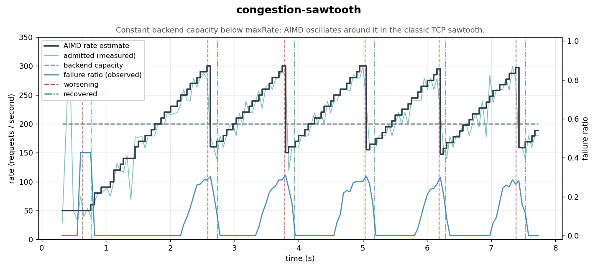
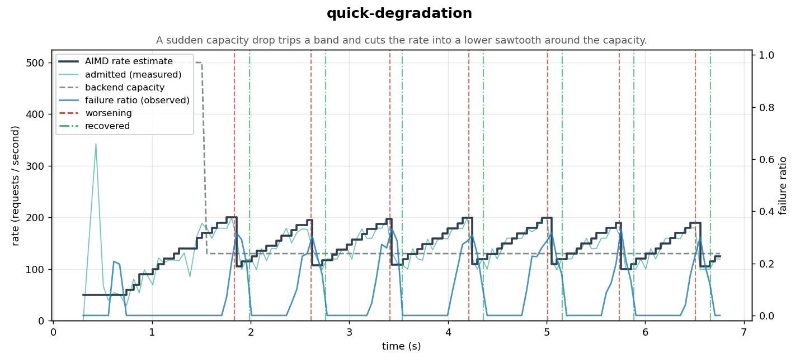
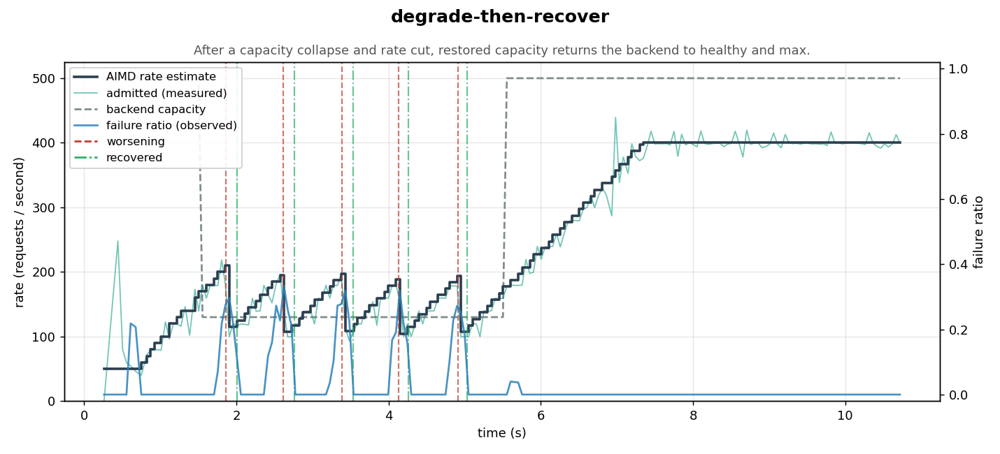
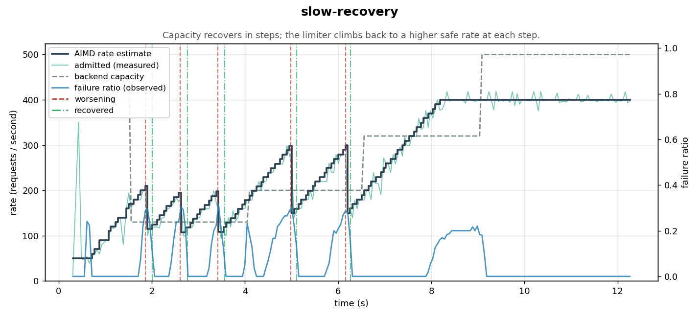
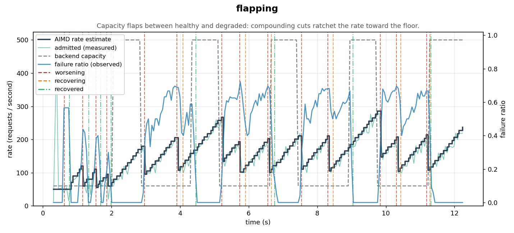
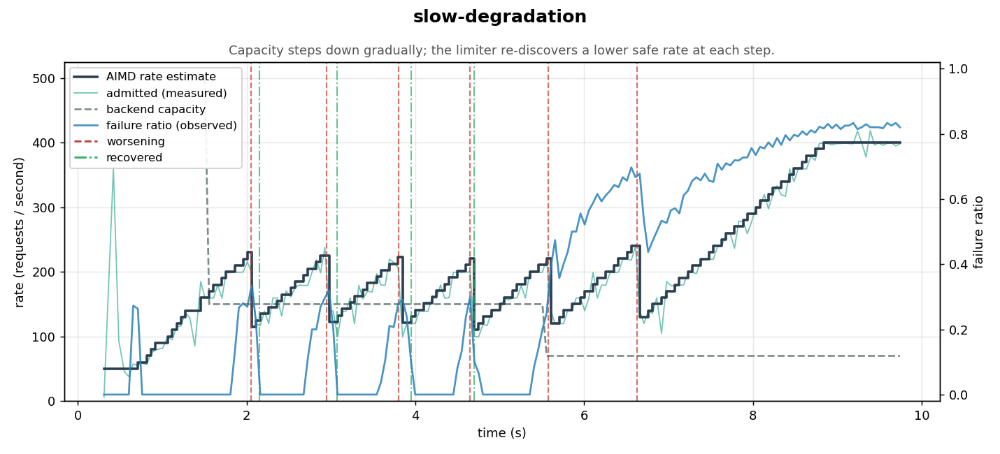
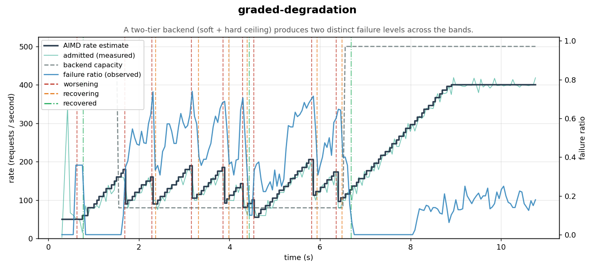

# Charts

Behavior charts for the [`adaptive-rate-limiter`](../adaptive-rate-limiter). This module runs the limiter through a
set of closed-loop scenarios against a *simulated* backend, exports the resulting timeseries as CSV, and renders them
to PNG with matplotlib. The images are what you see embedded in the project documentation.

This is a documentation/tooling module only — it is not published (`publish / skip := true`).

## Pipeline

Generating charts is a two-stage pipeline: Scala produces the data, Python renders it.

### 1. Generate the data (Scala)

```bash
sbt "charts/run"
```

This drives every [`Scenario`](src/main/scala/io/mienks/resilience/charts/Scenario.scala) through the limiter (in
parallel) and writes, under `docs/charts/data/`:

- `<scenario>-samples.csv` — the dense sampled timeseries (`elapsed_ms`, `aimd_rps`, `admitted_rps`,
  `backend_capacity_rps`, `observed_failure_ratio`).
- `<scenario>-events.csv` — discrete control-loop events (rate changes and `FailureGradient` band crossings).
- `manifest.csv` — the index of scenarios the renderer reads.

You can override the output directory: `sbt "charts/run /tmp/charts-data"`.

### 2. Render the charts (Python)

```bash
python3 -m venv .venv && source .venv/bin/activate
pip install -r charts/scripts/requirements.txt
python charts/scripts/render.py
```

`render.py` is data-driven: it reads `manifest.csv` and writes one PNG per scenario into
`docs/images/adaptive-rate-limiter/`, so adding a scenario on the Scala side requires no change to the Python.
Override the directories with `--data-dir` / `--out-dir`.

## How the simulated backend works

The whole point of the adaptive rate limiter is to *discover* the rate a downstream resource can sustain. To exercise
that, we need a backend whose failure rate depends on how hard we hit it — otherwise the control loop has nothing to
react to. That backend is modeled in [`Backend.scala`](src/main/scala/io/mienks/resilience/charts/Backend.scala).

A backend phase is a **hard ceiling** plus zero or more **soft ceilings**, each a token bucket (the project's own
[`DynamicRateLimiter`](../rate-limiter)):

- The **hard ceiling** is the base, sustainable rate. Any call admitted *above* it fails outright (100%).
- Each **soft ceiling** (`SoftCeiling(capacity, failProbability)`, with `failProbability < 1.0`) is a tighter rate
  that fails only a *fraction* of the calls that overflow it.
- Every call consumes one token from the hard bucket and every soft bucket, and fails with the **most severe**
  `failProbability` among the ceilings it overflowed (the hard ceiling contributing `1.0`).

So the observed failure ratio is an emergent property of the rate the limiter admits — overflow a ceiling and failures
appear, back off and they clear. This is what closes the loop:

```
AIMD rate estimate ──admits requests──▶ Backend (hard + soft ceilings)
        ▲                                      │
        └────────── failure ratio ◀────────────┘
```

Two backend shapes are used:

- **Hard ceiling only** (`softCeilings = Nil`): one bucket at the base capacity whose overflow always fails. The
  failure ratio is essentially `1 - capacity/admitted`.
- **Graded** (a soft ceiling under the hard one): e.g. over `rps(80)` fail 100%, but already over the smaller
  `rps(40)` fail 50%. This produces two distinct failure levels and trips both hysteresis bands.

A [`Scenario`](src/main/scala/io/mienks/resilience/charts/Scenario.scala) is the limiter config plus a
`NonEmptyList[Backend.Phase]` — the backend's capacity over time. A hard ceiling *below* the limiter's `maxRate` is a
degraded backend; raising it again is recovery. The whole schedule is handed to `Backend.create` up front, and an
internal fiber walks it, reconfiguring the ceilings as each phase begins (there is no external capacity mutator). A
shared `Warmup` settle time is folded into the first phase's duration.
[`SimulationRunner`](src/main/scala/io/mienks/resilience/charts/SimulationRunner.scala) offers load through
`limiter.protect`, samples the limiter's rate/failure-ratio on a fixed cadence, and records every control-loop event.

> Note: rates are kept in the hundreds of rps even though the time scale is compressed to a few seconds. The closed
> loop derives the failure ratio from requests the limiter *actually admits*, so each measurement window needs enough
> admitted requests for the ratio to be meaningful.

## Scenarios

Each chart plots, on the left axis, the **AIMD rate estimate** (controlled variable), the **admitted** throughput
(measured), and the **backend capacity** (the bottleneck being discovered, dashed); on the right axis the limiter's
**observed failure ratio**. Vertical lines mark `worsening` / `recovering` / `recovered` control-loop events.

### congestion-sawtooth
Constant backend capacity below `maxRate`: AIMD oscillates around it in the classic TCP sawtooth — additive increase
ramps the rate up until failures appear, a multiplicative decrease cuts it, and the cycle repeats.



### quick-degradation
A sudden capacity drop trips a band and cuts the rate into a lower sawtooth around the new, reduced capacity.



### degrade-then-recover
After a capacity collapse and rate cut, restored capacity returns the backend to healthy and the rate climbs back to
`maxRate`.



### slow-recovery
Capacity recovers in steps; the limiter climbs back to a higher safe rate at each step.



### flapping
Capacity flaps between healthy and degraded: compounding cuts ratchet the rate toward the floor.



### slow-degradation
Capacity steps down gradually; the limiter re-discovers a lower safe rate at each step.



### graded-degradation
A two-tier backend (soft + hard ceiling) produces two distinct failure levels across the hysteresis bands.


